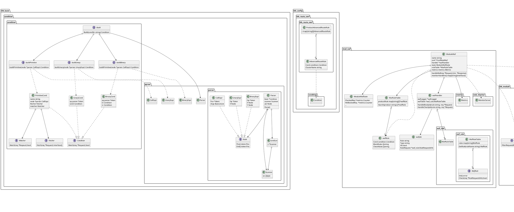

```plantuml
@startuml


package bfe_basic {
    package condition {
        package parser {
            class parser.Parser {
                lexer *condLex
                scanner Scanner
                ast Node

                Parse()
            }
            parser.Parser o--> parser.Node
            parser.Parser o--> parser.Scanner
            parser.Parser o--> parser.condLex

            class parser.Scanner {
                src []byte
            }

            class parser.condLex {
                s *Scanner
            }
            parser.condLex o--> parser.Scanner

            interface parser.Node {
                Pos() token.Pos
                End() token.Pos
            }

            class parser.CallExpr {
                Fun *Ident
                Args BasicLitList
            }
            parser.CallExpr ..|> parser.Node

            class parser.BinaryExpr {
                Op Token
                X Node
                Y Node
            }
            parser.BinaryExpr ..|> parser.Node

            class parser.UnaryExpr {
                Op Token
                X Node
            }
            parser.UnaryExpr ..|> parser.Node
        }

        interface condition.Condition {
            Match(req *Request) bool
        }

        class condition.BinaryCond {
            op parser.Token
            lc Condition
            rc Condition
        }
        condition.BinaryCond ..|> condition.Condition

        class condition.UnaryCond {
            op parser.Token
            cond Condition
        }
        condition.UnaryCond ..|> condition.Condition

        interface condition.Fetcher {
            Fetch(req *Request) interface{}
        }
        interface condition.Matcher {
            Match(req *Reqeust) bool
        }
        class condition.PrimitiveCond {
            name string
            node *parser.CallExpr
            fetcher Fetcher
            matcher Matcher
        }
        condition.PrimitiveCond ..|> condition.Condition
        condition.PrimitiveCond o--> condition.Fetcher
        condition.PrimitiveCond o--> condition.Matcher


        interface condition.Build {
            Build(condStr string) Condition
        }
        condition.Build --> parser.Parser
        condition.Build o--> condition.buildBinary
        condition.Build o--> condition.buildUnary
        condition.Build o--> condition.buildPrimitive

        interface condition.buildBinary {
            buildPrimitive(node *parser.CallExpr) Condition
        }
        condition.buildBinary ..> parser.BinaryExpr
        condition.buildBinary ..> condition.BinaryCond

        interface condition.buildUnary {
            buildUnary(node *parser.UnaryExpr) Condition
        }
        condition.buildUnary ..> parser.UnaryExpr
        condition.buildUnary ..> condition.UnaryCond

        interface condition.buildPrimitive {
            buildPrimitive(node *parser.CallExpr) Condition
        }
        condition.buildPrimitive ..> parser.CallExpr
        condition.buildPrimitive ..> condition.PrimitiveCond
    }
}


package bfe_config {
    package bfe_route_conf {
        class bfe_route_conf.ProductAdvancedRouteRule {
            r map[string][]AdvancedRouteRule
        }
        bfe_route_conf.ProductAdvancedRouteRule "1" o--> "n" bfe_route_conf.AdvancedRouteRule

        class bfe_route_conf.AdvancedRouteRule {
            Cond condition.Condition
            ClusterName string
        }
        bfe_route_conf.AdvancedRouteRule ..|> condition.Condition
    }
}


package bfe_balance {
    package backend {
        class backend.BfeBackend {
            Addr string
            Port int 
        }
    }

    package bal_gslb {
        class bal_gslb.BalanceGslb {
            name string
            BalanceMode string

            Balance(req *Request) *bal_backend.BfeBackend
        }
        bal_gslb.BalanceGslb ..> backend.BfeBackend
    }

    class bfe_balance.BalTable {
        balTable map[string]*bal_gslb.BalanceGslb

        Lookup(clusterName string) *bal_gslb.BalanceGslb
    }
    bfe_balance.BalTable "1" o--> "n" bal_gslb.BalanceGslb
}


package bfe_server {
    class BfeServer {
        Config bfe_conf.BfeConfig
        connWaitGroup sync.WaitGroup
        ServerConf *bfe_route.ServerDataConf
        Modules *bfe_module.BfeModules

        Serve(l net.Listerner, ...)
        findProduct(req *Request) error
        findCluster(req *Request) error

        RegisterModules(modules []string)
        InitModules()
    }
    BfeServer "1" *--> "n" conn
    BfeServer *--> ReverseProxy
    BfeServer o--> bfe_module.BfeCallbacks
    BfeServer o--> bfe_route.ServerDataConf
    BfeServer "1" *--> "n" bfe_module.BfeModule

    class conn {
        server *BfeServer
        remoteAddr string
        rwc net.Conn

        serve()
    }
    conn ..> ReverseProxy

    class ReverseProxy {
        server *BfeServer
        balTable *bfe_balance.BalTable

        ServeHTTP(ResponseWriter, Request)
        FinishReq(ResponseWriter, Request)
        clusterInvoke(cluster *bfe_cluster.BfeCluster,...) *Response
    }
    ReverseProxy ..> bfe_http.ResponseWriter
    ReverseProxy ..> bfe_http.Request
    ReverseProxy ..> bfe_module.HandlerList
    ReverseProxy o--> bfe_balance.BalTable
    ReverseProxy ..> bal_gslb.BalanceGslb
}


package bfe_http {
    class ResponseWriter {}
    class Request {}
}


package bfe_module {
    interface BfeModule {
        Name() string
        Init(*BfeCallbacks, *web_monitor.WebHandlers, confRoot string)
    }

    class BfeCallbacks {
        callbacks map[CallbackPoint]*HandlerList

        GetHandlerList(point CallbackPoint)
        AddFilter(point CallbackPoint, f interface{})
    }
    BfeCallbacks --> CallbackPoint
    BfeCallbacks "1" o--> "n" HandlerList

    enum CallbackPoint {
        HandleAccept
        HandleHandshake
        HandleFoundProduct
        HandleAfterLocation
        HandleForward
        HandleReadResponse
        HandleRequestFinish
        HandleFinish
    }

    class HandlerList {
        handlerType HandlersType
        handlers *list.List

        FilterRequest(Request) (int, Response)
        FilterResponse(Request) int
        FilterAccept(Session) int
        FilterForward(Request) int
        FilterFinish(Session) int
    }
    HandlerList --> HandlersType
    HandlerList "1" --> "n" RequestFilter
    HandlerList "1" --> "n" ResponseFilter
    HandlerList "1" --> "n" AcceptFilter
    HandlerList "1" --> "n" ForwardFilter
    HandlerList "1" --> "n" FinishFilter
    HandlerList ..> HandlerReturnType

    enum HandlersType {
        HandlersAccept
        HandlersRequest
        HandlersForward
        HandlersResponse
        HandlersFininsh
    }

    interface RequestFilter {
        FilterRequest(Request) (int, Response)
    }
    RequestFilter --> HandlerReturnType
    interface ResponseFilter {
        FilterResponse(Request) int
    }
    ResponseFilter --> HandlerReturnType
    interface AcceptFilter {
        FilterAccept(Session) int
    }
    AcceptFilter --> HandlerReturnType
    interface ForwardFilter {
        FilterForward(Request) int
    }
    ForwardFilter --> HandlerReturnType
    interface FinishFilter {
        FilterFinish(Session) int
    }
    FinishFilter --> HandlerReturnType

    enum HandlerReturnType {
        BfeHandlerFinish
        BfeHandlerGoOn
        BfeHandlerRedirect
        BfeHandlerResponse
        BfeHandlerClose
    }
}


package baidu_golib {
    package metrics {
        class metrics.Counter {
            Get() int64
            Set() int64
        }
        class metrics.Gauge {
            Get() int64
            Set() int64
        }
        class metrics.State {
            Get() string
            Set() string
        }

        class metrics.MetricsData {
            Prefix string
            GaugeData map[string]int64
            CounterData map[string]int64
            StateData map[string]string

            Diff(last *MetricsData) *MetricsData
        }

        class metrics.Metrics {
            metricStruct interface{}
            counterMap map[string]*Counter
            gaugeMap map[string]*Gauge
            stateMap map[string]*State
            metricsLast *MetricsData
            metricsDiff *MetricsData

            GetAll() *MetricsData
            GetDiff() *MetricsData
        }
        metrics.Metrics "1" o--> "n" metrics.Counter
        metrics.Metrics "1" o--> "n" metrics.Gauge
        metrics.Metrics "1" o--> "n" metrics.State
        metrics.Metrics --> metrics.MetricsData
    }

    package web_monitor {
        enum web_monitor.WebHandlerType {
            WebHandleMonitor
            WebHandleReload
            WebHandlePprof
        }
        class web_monitor.WebHandlerMap {
            handlers map[string]interface{}
        }
        class web_monitor.WebHandlers {
            handlers map[WebHandlerType]*WebHandlerMap

            RegisterHandler(hType WebHandlerType, command string, f interface{})
            GetHandler(hType WebHandlerType, command string)
        }
        web_monitor.WebHandlers --> web_monitor.WebHandlerType
        web_monitor.WebHandlers --> web_monitor.WebHandlerMap

        class web_monitor.MonitorServer {
            port int
            webHandlers *WebHandlers

            webHandler(w http.ResponseWriter, r *http.Request)
        }
        web_monitor.MonitorServer o--> web_monitor.WebHandlers
    }
}


package mod_waf {
    package waf_rule {
        interface waf_rule.WafRule {
            Init() error
            Check(req *RuleRequestInfo) bool
        }
        class waf_rule.WafRuleTable {
            rules map[string]WafRule
            GetRule(ruleName string) WafRule
        }
        waf_rule.WafRuleTable "1" o--> "n" waf_rule.WafRule
    }

    class mod_waf.ModuleWaf {
        name string
        conf *ConfModWaf
        handler *wafHandler
        state ModuleWafState
        ruleTable *WarRuleTable
        metrics metrics.Metrics

        handleWaf(req *Request) (int, *Response)
        monitorHandlers() map[string]interface{}
    }
    mod_waf.ModuleWaf ..|> bfe_module.BfeModule
    mod_waf.ModuleWaf ..|> bfe_module.RequestFilter
    mod_waf.ModuleWaf o--> mod_waf.ModuleWafState
    mod_waf.ModuleWaf o--> mod_waf.WarRuleTable
    mod_waf.ModuleWaf ..> mod_waf.wafRule
    mod_waf.ModuleWaf o--> mod_waf.wafHandler
    mod_waf.ModuleWaf --> metrics.Metrics
    mod_waf.ModuleWaf ..> web_monitor.MonitorServer

    class mod_waf.ModuleWafState {
        CheckedReq *metrics.Counter
        HitBlockedReq  *metrics.Counter
        ...
    }

    class mod_waf.wafRule {
        Cond condition.Condition
        BlockRules []string
        CheckRules []string
    }

    class mod_waf.WarRuleTable {
        productRule map[string][]*wafRule
        Search(product string) []*wafRule
    }
    mod_waf.WarRuleTable "1" o--> "n" mod_waf.wafRule

    class mod_waf.wafJob {
        Rule string
        Type string
        Hit bool
        RuleRequest *waf_rule.RuleRequestInfo
    }

    class mod_waf.wafHandler {
        wafLogger *wafLogger
        wafTable *waf_rule.WafRuleTable

        HandleBlockJob(rule string, req *Request)
        HandleCheckJob(rule string, req *Request)
    }
    mod_waf.wafHandler "1" o--> "n" waf_rule.WafRuleTable
    mod_waf.wafHandler --> mod_waf.wafJob
}


package bfe_route {
    class ServerDataConf {
        HostTable *HostTable
        ClusterTable *ClusterTable
    }
    ServerDataConf o--> HostTable
    ServerDataConf o--> ClusterTable

    package trie {
        class trie.Trie {
            Children trieChildren
        }
        trie.Trie *--> trie.Trie
    }

    class route {
        product string
        tag string
    }

    class HostTable {
        hostTrie *trie.Trie
        productAdvancedRouteTable route_rule_conf.ProductAdvancedRouteRule

        LookupHostTagAndProduct(req *Request)
        LookupCluster(req *Reqeust)
        findHostRoute(host string) route
        findVipRoute(vip string) route
    }
    HostTable --> trie.Trie
    HostTable "1" o--> "n" route
    HostTable o--> bfe_route_conf.ProductAdvancedRouteRule
    HostTable ..> condition.Condition

    package bfe_cluster {
        class bfe_cluster.BfeCluster {
            Name string
            backendConf *cluster_conf.BackendBasic

            BackendConf() *cluster_conf.BackendBasic
            TimeoutReadClient() time.Duration
            ...()
        }
    }

    class ClusterTable {
        clusterTable ClusterMap

        Lookup(clusterName string) bfe_cluster.BfeCluster
    }
    ClusterTable "1" o--> "n" bfe_cluster.BfeCluster
}


@enduml
```