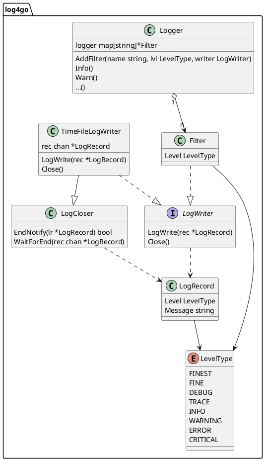

```plantuml
@startuml

package log4go {
    enum log4go.LevelType {
        FINEST
        FINE
        DEBUG
        TRACE
        INFO
        WARNING
        ERROR
        CRITICAL
    }

    class log4go.LogRecord {
        Level LevelType
        Message string
    }
    log4go.LogRecord --> log4go.LevelType

    class log4go.LogCloser {
        EndNotify(lr *LogRecord) bool
        WaitForEnd(rec chan *LogRecord)
    }
    log4go.LogCloser ..> log4go.LogRecord

    interface log4go.LogWriter {
        LogWrite(rec *LogRecord)
        Close()
    }
    log4go.LogWriter ..> log4go.LogRecord

    class log4go.Filter {
        Level LevelType
    }
    log4go.Filter --> log4go.LevelType
    log4go.Filter ..|> log4go.LogWriter

    class log4go.Logger {
        logger map[string]*Filter

        AddFilter(name string, lvl LevelType, writer LogWriter)
        Info()
        Warn()
        ...()
    }
    log4go.Logger "1" o--> "n" log4go.Filter

    class log4go.TimeFileLogWriter {
        rec chan *LogRecord

        LogWrite(rec *LogRecord)
        Close()
    }
    log4go.TimeFileLogWriter ..|> log4go.LogWriter
    log4go.TimeFileLogWriter --|> log4go.LogCloser
}

@enduml
```